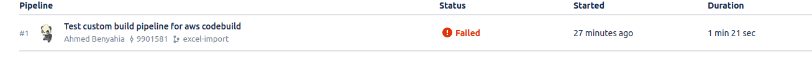

# A Custom bitbucket pipeline for aws codeBuild
 Run your build in an exiting aws codeBuild project using a simple node application that use aws sdk.
 
## How To Use It
+ Optional: Create a new AWS CodeBuild Project
+ Set the aws account credentials in the `config.json` file. There is a simple example named `config-exemple.json` 
+ Replace `"< Put Your Code Build Project Name Here>"` with the name of the aws CodeBuild Project in `codebuild.pipe.js` file.
+ Note:  Don't forget to enable pipelines in repository setting.

